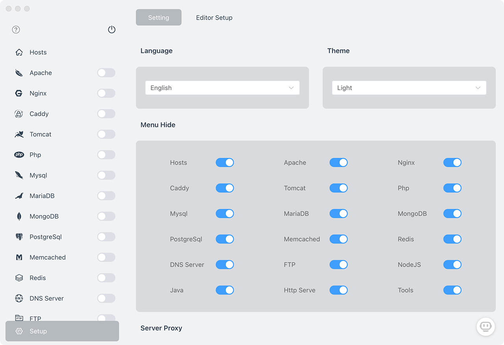

# FlyEnv(PhpWebStudy)


## Powerful Web Server and Environment Manager

## Support macOS / Windows / Linux

[](https://github.com/xpf0000/FlyEnv/releases)  [](https://github.com/xpf0000/FlyEnv/releases)

[](https://ko-fi.com/R5R2OJXTM)

## Main Modules

### Web Server

- [x] Apache
- [x] Nginx
- [x] Caddy
- [x] Tomcat

### Database Server

- [x] MySQL
- [x] MariaDB
- [x] PostgreSQL
- [x] MongoDB

### Email Server

- [x] Mailpit

### Language Env

- [x] PHP(Composer)
- [x] Java(Maven)
- [x] NodeJS
- [x] Python
- [x] Go

### Data Queue & Data Cache

- [x] Redis
- [x] Memcached
- [x] RabbitMQ(ERLang)

### Search Engine

- [ ] Elasticsearch

### Other

- [x] DNS Server
- [x] FTP Server
- [x] Static Http Server

## macOS:

### Homebrew

```
brew install phpwebstudy
```

### Intel X86:

[FlyEnv-4.6.0.dmg](https://github.com/xpf0000/FlyEnv/releases/download/v4.6.0/FlyEnv-4.6.0.dmg)

[FlyEnv-4.6.0-mac.zip](https://github.com/xpf0000/FlyEnv/releases/download/v4.6.0/FlyEnv-4.6.0-mac.zip)

### Apple Silicon

[FlyEnv-4.6.0-arm64.dmg](https://github.com/xpf0000/FlyEnv/releases/download/v4.6.0/FlyEnv-4.6.0-arm64.dmg)

[FlyEnv-4.6.0-arm64-mac.zip](https://github.com/xpf0000/FlyEnv/releases/download/v4.6.0/FlyEnv-4.6.0-arm64-mac.zip)

## Windows

[FlyEnv.Setup.4.5.6.exe](https://github.com/xpf0000/FlyEnv/releases/download/v4.5.6/FlyEnv.Setup.4.5.6.exe)

## Linux

### Debin / Ubuntu

#### X86_64

[PhpWebStudy_4.0.0_amd64.deb](https://github.com/xpf0000/FlyEnv/releases/download/v4.0.0/PhpWebStudy_4.0.0_amd64.deb)

#### arm64

[PhpWebStudy_4.0.0_arm64.deb](https://github.com/xpf0000/FlyEnv/releases/download/v4.0.0/PhpWebStudy_4.0.0_arm64.deb)

### Red Hat / Fedora / SUSE / CentOS

#### X86_64

[PhpWebStudy-4.0.0.x86_64.rpm](https://github.com/xpf0000/FlyEnv/releases/download/v4.0.0/PhpWebStudy-4.0.0.x86_64.rpm)

#### arm64

[PhpWebStudy-4.0.0.aarch64.rpm](https://github.com/xpf0000/FlyEnv/releases/download/v4.0.0/PhpWebStudy-4.0.0.aarch64.rpm)

FlyEnv is an all-in-one software designed to revolutionize the way you develop and test websites locally. With its advanced features and sleek design,
FlyEnv allows you to effortlessly create a local web server and access your websites using domain names. Say goodbye to tedious configurations and hello to streamlined web development.

Key Features:

1. Local Web Server: FlyEnv sets up a powerful local web server, enabling you to work on your websites without an internet connection. It acts as a standalone environment, providing an efficient and secure platform for your web development projects.

2. Domain Name Integration: Access your local websites using domain names, making it easier than ever to migrate your projects from development to production. No more convoluted URLs or IP addresses – simply assign unique domain names to ensure a seamless transition.

3. Support for Major Technologies: FlyEnv supports a wide range of technologies essential for web development. It includes PHP, MySQL, NGINX, Apache, MariaDB, MongoDB, PostgreSQL, Memcached, Redis, and Pure-FTP, ensuring compatibility with most web applications and frameworks.

4. Beautiful Interface: FlyEnv boasts a visually stunning and intuitive user interface, offering an exceptional user experience

Visit the website for detailed descriptions and tutorials on how to use it:

[https://www.flyenv.com](https://www.flyenv.com)

[Discord Community:](https://discord.gg/u5SuMGxjPE) https://discord.gg/u5SuMGxjPE

## ✨ FEATURES

- Simple and clear graphical interface
- Simultaneously run multiple PHP versions, supports PHP5.x - PHP8.x, run as PHP-FPM mode.
- Software version switching Choose the corresponding version for development and debugging according to development needs.
- Quickly create new projects, initialize with the selected framework, support: wordpress, laravel, yii2, symfony, thinkphp, codeIgniter, cakephp, slim
- Local DNS Server, access local sites from phones and other computers using domain names
- Customized configuration for each software
- Instant view of log files
- Site Management, set port number, php version, ssl certificate for each site
- One-click setting of nginx url rewrite for common PHP projects.
- One click to generate SSL self-signed certificate
- PHP code obfuscation, obfuscate a single file or the full project
- Commonly used in the development of tools, timestamp conversion, encoding / decoding, port occupation of one-click cleanup

## 🖥 application interface



## ⌨️ Development

### Cloning Code

```bash
git clone git@github.com:xpf0000/FlyEnv.git
```

### Install dependencies

```bash
cd PhpWebStudy
yarn install
```

### Run

```bash
yarn run dev
```

### Build

```bash
yarn run build
```

### PHP Versions

The brew libraries do not support older PHP versions, so if you want to use an older version of PHP, you need to use one of brew's third-party libraries.
Example:

[shivammathur/php](https://github.com/shivammathur/homebrew-php)

[phpbrew/phpbrew](https://github.com/phpbrew/phpbrew)

This application uses shivammathur/php, by default it will automatically add shivammathur/php libraries to the brew, but due to 'network problems', it may fail to add them.
You can add it by yourself, add command.

```
brew tap shivammathur/php
```

## Contribution

We welcome you to join us in this project. Maybe you don't need a lot of skills, but a few simple things can make the project better.
Examples of things you can do include, but are not limited to:
- Testing, finding bugs, and filing issues.
- Translation, using your own language, to make software and website descriptions more accurate.
- Making product requirements and suggestions
- Designing better looking interfaces and icons
- Helping to share the software with a wider audience
- Write a blog, or record a video.
- Add features such as php extensions, software modules, common tools, etc.

For developers You can take a look at this guide: [Development Guide](./DEV.md)

Thank you to all the people who already contributed to PhpWebStudy!

## Feedback and Suggestions

Mention the Issues, or scan the code to add QQ group.


## 📜 License

[BSD 3-Clause License](https://github.com/xpf0000/FlyEnv/blob/master/LICENSE)
